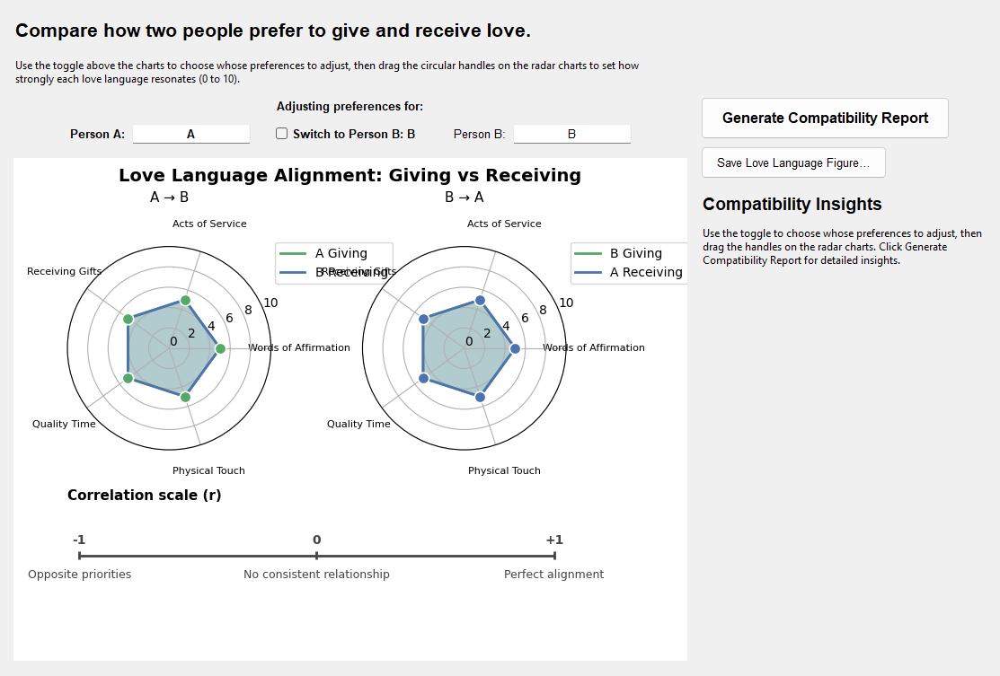
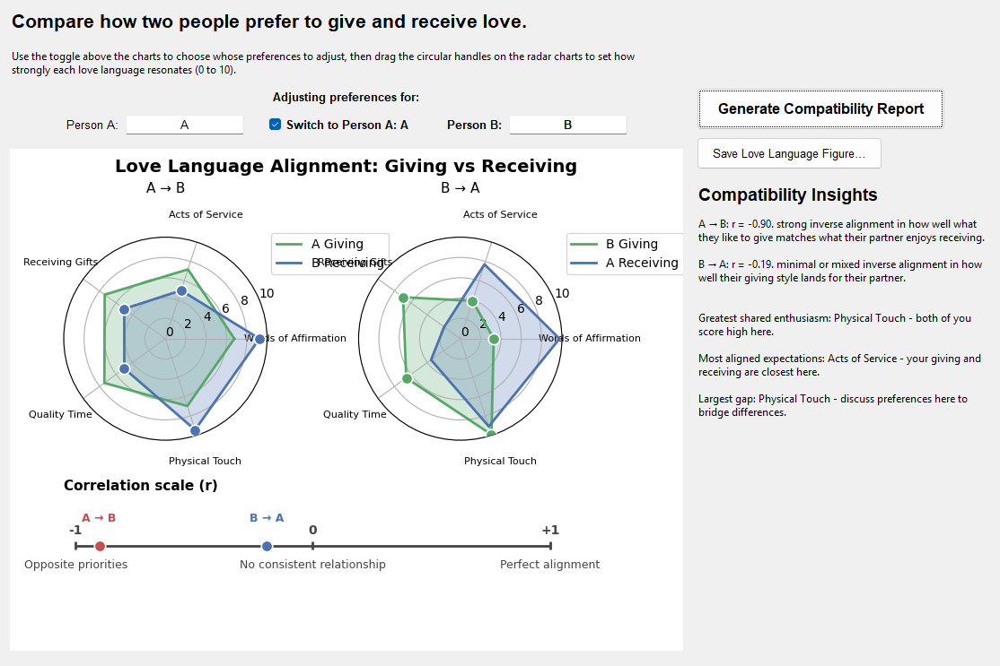

# AffectionMap


AffectionMap is a desktop application that helps couples, friends, and teams compare their preferred love languages. Enter how two people give and receive affirmation, quality time, gifts, acts of service, and physical touch to generate a compatibility report that highlights alignment and gaps.

## Features

- Guided data entry with validation for two participants
- Automatic scoring of five love language categories (0–10 scale)
- Radar charts that visualize how closely love language preferences align
- Quantitative similarity metrics, including Pearson correlation and difference scores
- Narrative insights that summarize areas of harmony and opportunities for growth

## Prerequisites

- Python 3.10 or later
- A desktop environment capable of rendering Tkinter windows
- System libraries required by Matplotlib (install via your OS package manager if prompted)

## Installation

1. (Optional) Create and activate a virtual environment.
2. Install the dependencies:

   ```bash
   pip install -r requirements.txt
   ```

## Usage

1. Launch the graphical interface:

   ```bash
   python main.py
   ```

2. Enter a name for each person along with their love language scores. Values must be on a 0–10 scale.
3. Select **Generate Compatibility Report** to compute the alignment analysis.
4. Review the generated radar plots and written insights to understand the relationship dynamics.


### Compatibility report

Show the radar chart comparison and summary analysis returned after clicking **Generate Compatibility Report**.



## Understanding the results

- **Radar charts** visualize each participant’s comfort with giving and receiving each love language, making it easy to spot differences at a glance.
- **Similarity metrics** (correlation and absolute score differences) quantify how closely aligned the two profiles are.
- **Insight summaries** provide actionable reflections on strengths and potential friction points.

## Testing

Run the automated tests to ensure the scoring and analytics logic behave as expected:

```bash
pytest
```

## Troubleshooting

- If the window does not appear, confirm that you are running the application in an environment with GUI support (e.g., local machine or remote desktop with X forwarding).
- If Matplotlib fails to import due to missing system libraries, install the appropriate packages for your operating system (for example, `sudo apt-get install libfreetype6-dev` on Debian/Ubuntu).

## Contributing

1. Fork the repository and create a feature branch.
2. Install development dependencies and ensure tests pass.
3. Submit a pull request describing your changes and include screenshots that replace the placeholders above.

## License

AffectionMap is released under the MIT License. See [LICENSE](LICENSE) for details.
